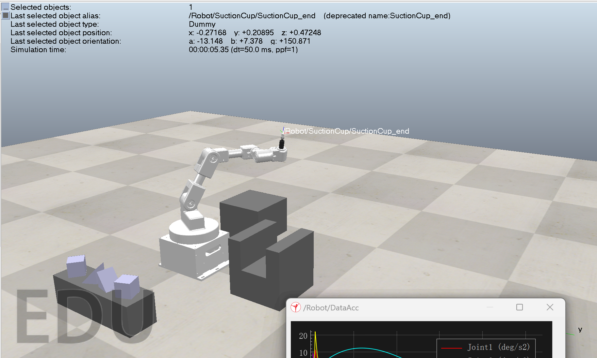
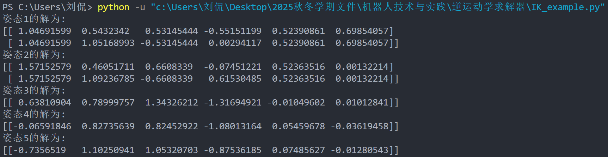
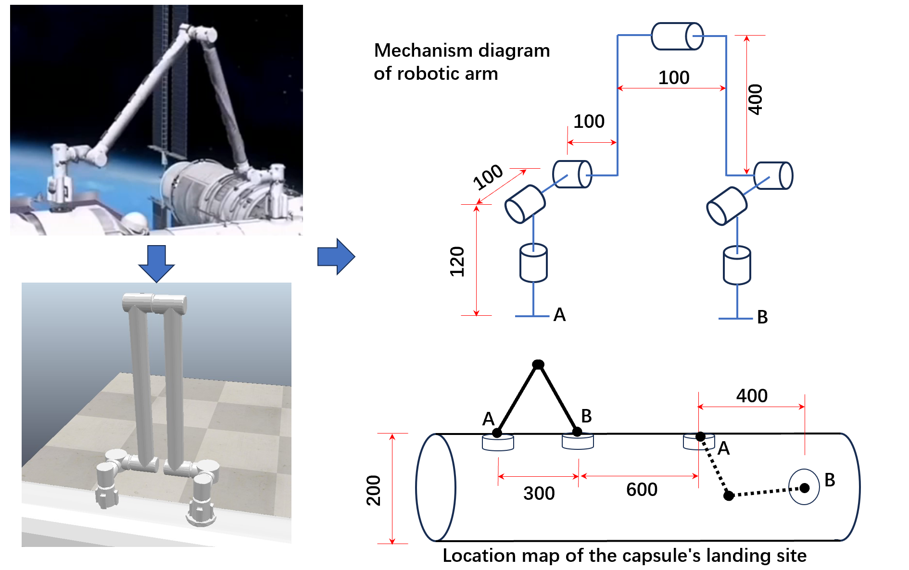

# Robotics_and_Practice

This is the coursework for the Zhejiang University Zhu Kezhen College Engineering High School course **Robotics and Practice** , which is mainly divided into the following Parts.

## Footed Robot

In this part, we first learned basic knowledge of robotics and how to use **SolidWorks** to build model of SCARA robot, then make motion simulation of another robotic arms using **CoppeliaSim.**

We learned the forward kinematics and inverse kinematics solutions for robots

The following video shows the simulation of a robotic arm gripping blocks and placing them into a specific shape after a specific motion.

### space station robot arm

This is the final task as the end of footed robot part, we should first calculate the inverse kinematics, then simulate the motion in CoppeliaSim which is really hard because of the details.

<video src="image/README/space_station_robot_arm_simulation.mp4" autoplay="true" controls="controls" width="800" height="600">
</video>

Considering the motion is too complex, we are only required to build the real robot and make it move a step.

<video src="image/README/space_station_robot_arm.mp4" autoplay="true" controls="controls" width="800" height="600">
</video>

## Wheeled Robot

We first installed Ubuntu, ROS2, Nav2, and configured Nav2, then completed Gazebo navigation simulation and visualization of TF, sensors, maps, etc. on RVIZ. The environmemt configuration was really a headache🤯

The following video shows we use the embedded navigation algorithm of Global Planner.

<video src="image/README/embedded_algorithm.mp4" autoplay="true" controls="controls" width="800" height="600">
</video>

### RRT* Algorithm

The following video shows we use the RRT* algorithm written by ourselves.

<video src="image/README/RRT_algorithm.mp4" autoplay="true" controls="controls" width="800" height="600">
</video>
